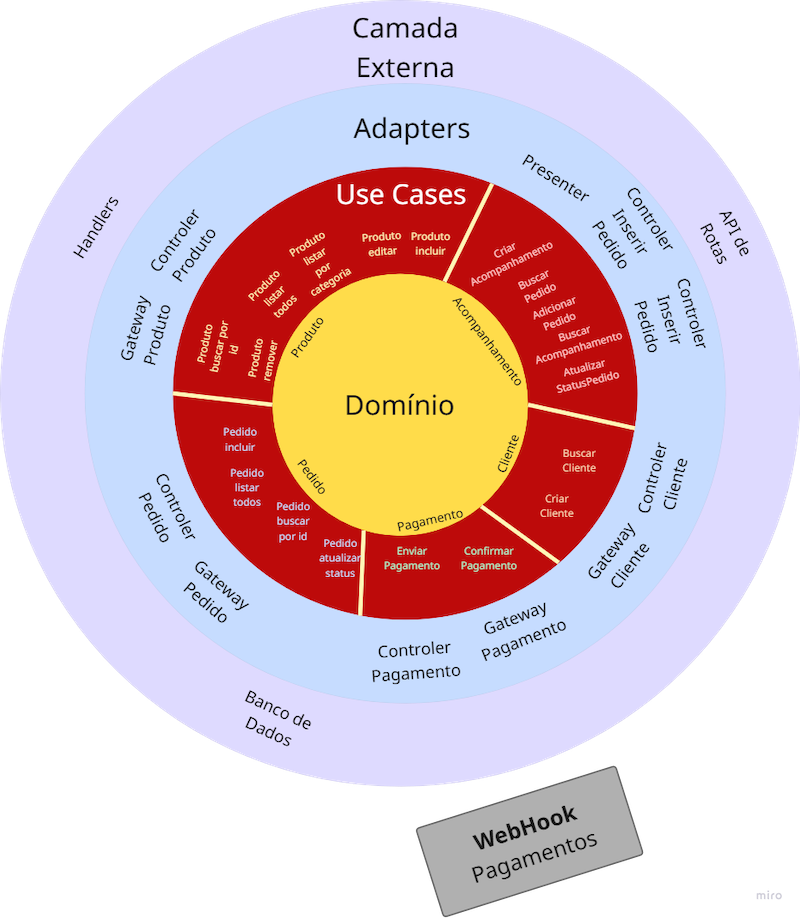

# FIAP PosTech - 10SOAT - Grupo 38
Repositório de entregas para o Tech-Challenge 02 para o curso de pós-graduação em Arquitetura de Software da FIAP, PosTech turma 10SOAT.

Construído com:

[![Go][Go]][Go-url] [![Gin][Gin]][Gin-url] [![MongoDB][Mongo]][Mongo-url] [![Redis][Redis]][Redis-url] [![Swagger][Swagger]][Swagger-url] [![Docker][Docker]][Docker-url] [![Kubernetes][Kubernetes]][Kubernetes-url]

## Componentes do Grupo:
- Alexandre Sato - RM360670
- Bruno Araújo - RM360188
- Iana Neri - RM360484
- Juliano Lopes - RM360639

## Estrutura Deste Repositório

```
.
├── app                   <- diretorio da aplicação
│   ├── .env              <- variáveis de ambiente
│   ├── dockerfile        <- dockerfile da aplicação
│   └── main.go           <- arquivo main.go para aplicação
├── img                   <- diretorio com imagens de apoio
├── k8s                   <- pasta com manifestos do Kubernetes
├── mongodb               <- diretorio do Mongo DB
│   └── dockerfile        <- dockerfile do Mongo DB
├── webhook-pagamentos    <- diretorio do Webhook de pagamentos
│   ├── payment
│   ├── queue
│   ├── sender
│   ├── redis             <- diretorio do redis
│   │   └── dockerfile    <- dockerfile do redis
│   ├── dockerfile        <- dockerfile do webhook de pagamentos
│   ├── composer.yaml     <- arquivo Docker Composer para webhook de pagamentos
│   └── main.go           <- arquivo main.go para webhook de pagamentos
├── compose.yaml          <- arquivo Docker Composer para a solução toda
└── README.md             <- este README
```

## Fase 02 - Entregas:

### 1. Atualização da aplicação desenvolvida na FASE 1:
```text
Refatorando o código para seguir os padrões Clean Code e Clean Architecture:
    a. Alterar/criar as APIs:
        i. Checkout Pedido que deverá receber os produtos solicitados e retornar a identificação do pedido.
        ii. Consultar status de pagamento pedido, que informa se o pagamento foi aprovado ou não.
        iii. Webhook para receber confirmação de pagamento aprovado ou recusado, a implementação deve ser clara quanto ao Webhook.
        iv. A lista de pedidos deverá retorná-los com suas descrições, ordenados com a seguinte regra:
            1. Pronto > Em Preparação > Recebido;
            2. Pedidos mais antigos primeiro e mais novos depois;
            3. Pedidos com status Finalizado não devem aparecer na lista.
        v. Atualizar o status do pedido.
            1. Todo fluxo do pedido deve ser atualizado, tal informação deverá ser utilizada pela cozinha garantindo que nenhum pedido seja perdido e que a cozinha possa iniciar a preparação após o pagamento.
        vi. Opcionalmente, como desafio extra, você pode implementar a integração com Mercado Pago para gerar o QRCode para pagamento e integrar com o WebHook para capturar os pagamentos. Caso contrário, será necessário realizar o mock da parte de pagamentos. Como referência, acesse: site do mercado pago.
```

### 2. Criar uma arquitetura em Kubernetes
```text
Criar uma arquitetura em Kubernetes que atenda os seguintes requisitos:
    a. Os requisitos funcionais descritos nos itens anteriores (item problema).
    b. Escalabilidade com aumento e diminuição de Pods conforme demanda (HPA).
    c. Os arquivos manifestos (yaml) precisam estar no Github junto com a nova versão do código.
    d. Seguir boas práticas de segurança, utilizando ConfigMap e Secrets para valores sensíveis.
    e. Seguir boas práticas de arquitetura, sempre utilizando Deployment e Service para expor a aplicação.
```

### 3. Entrega de Documentação

```
Entrega da seguinte documentação no ReadMe:
    a. Desenho da arquitetura pensado por você, pessoa arquiteta de software, contemplando:
        i. Os requisitos do negócio (problema).
        ii. Os requisitos de infraestrutura:
            - Você pode utilizar o Minikube, Kind, AKS, EKS, GKE ou qualquer nuvem que você desejar.
    b. Collection com todas as APIs desenvolvidas com exemplo de requisição (que não seja vazia):
        i. Link do Swagger no projeto ou link para download da collection do Postman (JSON).
    c. Guia completo com todas as instruções para execução do projeto e a ordem de execução das APIs, caso seja necessário.
    d. Link para vídeo demonstrando a arquitetura desenvolvida na nuvem ou localmente, evidenciando o funcionamento dos endpoints (API) e a infra criada.
        i. O vídeo deve ser postado no Youtube ou Vimeo.
        ii. Não esqueça de deixá-lo público ou não listado.
```

### [Link para o vídeo](https://youtu.be/HAM7cF1T_gc)

### Fluxo de execução das APIs:

Seguindo a lógica de negócios, ao iniciarmos a lanchonete, será preciso ter os produtos a serem oferecidos para compra, sendo assim, devemos iniciar a criação dos produtos:

1. rota criar produtos: `[POST] /produto`

    Campos:
   * categoria: Lanches, Bebidas, Acompanhamentos, Sobremesas (case-sensitive)
   * descricao: string (opcional)
   * identificacao: string (como exemplo utilizamos números em formato string)
   * nome: string
   * preco: float32 (pode adicionar inteiro que será convertido para float)

2. rota busca produto por id: `[GET] /produto/{ID}`

    Campos:
   * id: path id do produto (identificacao)

3. rota busca produto por categoria: `[GET] /produtos/{categoria}`

    Campos:
   * Categoria de produtos (categoria)

4. rota listar todos os produtos: `[GET] /produtos`

    Campos:
   * N/A, basta apenas executar a rota

5. rota editar produto: `[POST] /produto/editar`

    Campos
   * manter apenas o campo a ser alterado no body da requisição

6. rota remover produto: `[DELETE] /produto/{ID}`

    Campos:
   * ID do produto (identificacao)

----

Para que os produtos sejam adquiridos, precisamos de clientes, então o fluxo segue com o cadastro de clientes:

1. rota cria cliente: `[POST] /cliente`

   Campos:
   * cpf: string
   * email: string
   * nome: string

2. rota busca cliente: `[GET] /cliente/{CPF}`

   Campos:
   * CPF do cliente (cpf)

----

Para que os clientes possam adquirir produtos da lanchonete, eles precisam fazer os pedidos, sendo assim, o fluxo segue com a criação de pedidos:

1. rota cria pedido: `[POST] /pedidos`

   Campos:
   * Objeto cliente:
   * cpf: string
   * email: string
   * nome: string
   * personalização: string (opcional)
   * identificacao: será a identificação do pedido, e deve ser removido do corpo da requisição, pois será criado automáticamente.
   * produtos (pode adicionar 1 ou mais produtos, cada um separa em um objeto):
   * categoria: Lanches, Bebidas, Acompanhamentos, Sobremesas (case-sensitive)
   * descricao: string
   * identificacao: identificação do produto, string
   * nome: string
   * preco: float32 (pode adicionar inteiro que será convertido para float)
   * remover os campos: status, timeStamp, total e ultimaAtualizacao, pois serão definidos automaticamente.

2. rota buscar pedido por id: `[GET] /pedido/{ID}`

   Campos:
   * Número do pedido: string (identificação)

3. rota listar todos os pedidos: `[GET] /pedidos/listartodos`

   Campos:
   * N/A, basta apenas executar a rota

----

Após a criação do pedido é necessário que seja enviado um pagamento ao webhook que faz o processamento do pagamento. O webhook irá retornar um payload via terminal que irá retornar se o pagamento foi Recebido ou Negado. A rota pagamento/confirmar receberá uma requisição post vinda do webhook e atualizará o status do pedido. Segue o fluxo da criação de pagamentos:

1. rota envia pagamento: `[POST] /pagamento`

   Campos:
    * Objeto pagamento:
    * dataCriacao: será gerada automaticamente
    * idPagamento: mesmo id do pedido
    * status: default "Pendente", após processamento do Webhook irá ser atualizado para Recebido ou Negado
    * valor: string

2. rota	confirmação do pagamento: `[POST] /pagamento/confirmar - Receberá o payload do webhook com os seguintes valores`

    Campos:
    * Objeto pagamento:
    * dataCriacao: será gerada automaticamente
    * idPagamento: mesmo id do pedido
    * status: "Recebido" ou "Negado", virá após o processamento do pagamento via Webhook
    * valor: string

----

Para que a cozinha possa gerenciar os pedidos, há um objeto entidade Acompanhamento, onde a cozinha será capaz de alterar o status de cada pedido desde seu recebimento até a disponibilização ao cliente.

Para isso, o objeto Acompanhamento engloba uma fila de pedidos. o objetivo deste objeto, além da manipulação pela cozinha, é disponibilizar as informações para os clientes.

Sendo assim, o objeto acompanhamento pode ser, ou criado para o fluxo diário da lanchonete, onde os pedidos serão adicionados e removidos quando estiverem com o status Finalizado, ou ainda, pode reutilizar um único objeto criado para todo e  qualquer dia, onde ele sempre estará com a fila vazia no início do expediente e terminará o expediente com a fila vazia ao ter sido finalizado dos os pedidos feitos neste dia.

Segue abaixo o fluxo das rotas de API do Acompanhamento:

1. rota criar acompanhamento:  `[POST] /acompanhamento`

   Campos:
   * id: string ( será o id do objeto acompanhamento )
   * pedidos: objeto fila de pedidos
   * pedidos: array FIFO de pedidos ( deve ser iniciado com o array [] vazio, sendo necessário remover os campos específicos do pedido de dentro deste array.
   * tempoEstimado: última chave "tempoEstimado" ao final do objeto, do tipo Time.Duration (int com padrão 900, que corresponde a 15 minutos ou 900 segundos)
   * ultimaAtualizacao": string no formato date-time, que pode ser removida, pois será adicionada automaticamente.

2. rota adicionar pedido ao acompanhamento: `[POST] /acomapnhamento/{IDAcompanhamento}/{IDPedido}`

   Campos:
   * Id do acompanhamento: string
   * id do pedido: string

3. rota busca pedido: `[GET] /acompanhamento/{Id}`

   Campos:
   * Id do pedido, string

4. rota atualiza status do pedido: `[PUT] /acompanhamento/{IDAcompahnamento}/{IDPedido}/{status}`

    Campos:
   * Id do acompanhamento: string
   * Id do pedido: string
   * status: string (Recebido, Em preparação, Pronto, Finalizado)

OBS: ao ser definido o status como Finalizado, o pedido será removido da fila de pedidos.

5. rota mostrar acompanhamento: `[GET] /acomapnhamento/show`

    Campos:
   * Id do acompanhamento: string

OBS: esta rota representa o presenter, onde ela é apresentada para a cozinha para poderem gerenciar os pedidos, e também pode ser utilizada para exibir os pedidos para os clientes.


### Requisitos Funcionais:

<figure>
    
    <figcaption>Requisitos funcionais em Clean Architecture</figcaption>
</figure>

### Arquivos manifestos YAML

Os arquivos de manifesto estão no diretório `kubernetes`, separados por `deployment`, para boas práticas de arquitetura e `configmap`, para registro e declaração de valores sensíveis. Para publicar os serviços de cada POD, há também o manifesto de `service` para expor a porta de serviço. Todos os arquivos usam o padrão de prefixos conforme abaixo:

- app: aplicação principal
- database: O Mongo DB de suporte à aplicação
- redis: Uma base de dados Redis para suporte à aplicação de webhook de pagamentos
- webhook: Aplicação à parte para simular meios de pagamento com webhook

### Disponibilização das Imagens Docker

Para reproduzir a funcionalidade da solução em Kubernetes, é necessário ter acesso às imagens Docker dos containers para serem utilizados em suas respectivas PODs. No repositório atual, disponibilizamos os `Dockerfiles` de cada um dos componentes da aplicação:

- Aplicação principal: `./app/Dockerfile`
- Mongo DB: `./mongodb/Dockerfile`
- Componente de Pagamento com WebHook: `./webhook-pagamentos/Dockerfile`
- Redis para o WebHook de Pagamentos: `./webhook-pagamentos/redis/Dockerfile`

Adicionalmente a imagem "buildada" está disponível em repositório público no Docker Hub como `akzsato/`.

### Testando o Ambiente com minikube

Minikube é um Kubernetes local, visando facilitar o aprendizado e o desenvolvimento para Kubernetes. Para este exemplo utilizamos o Docker como ferramenta de conteinerização. Para este exemplo, utilizaremos imagens criadas localmente via docker e faremos a chamada dessas imagens pelo minikube. Com o Docker Desktop ativo em seu computador, inicialize o minikube referenciando o Docker:

```shell
minikube start
```

A partir da raiz do repositório inicialize os manifestos YAML:

```shell
kubectl apply -f ./k8s
```

Valide os pods no ar:

```shell
kubectl get pods
```

Valide os serviços descritos nos manifestos:

```shell
kubectl get services
```

Exponha os serviços via minikube:

```shell
minikube service app
```

Este comando criará um túnel a partir de um navegador. A URL original é: `http://localhosta:8080/docs/index.html`
Neste caso utilize a porta aleatória criada pelo minikube e acrescente o restante da URL no navegador. Exemplo:

```shell
❯ minikube service app
|-----------|------|-------------|--------------|
| NAMESPACE | NAME | TARGET PORT |     URL      |
|-----------|------|-------------|--------------|
| default   | app  |             | No node port |
|-----------|------|-------------|--------------|
😿  service default/app has no node port
❗  Services [default/app] have type "ClusterIP" not meant to be exposed, however for local development minikube allows you to access this !
🏃  Starting tunnel for service app.
|-----------|------|-------------|------------------------|
| NAMESPACE | NAME | TARGET PORT |          URL           |
|-----------|------|-------------|------------------------|
| default   | app  |             | http://127.0.0.1:52464 |
|-----------|------|-------------|------------------------|
🎉  Opening service default/app in default browser...
```

Então a porta criada foi a 52464 neste caso. Assim a URL para acessar o Swagger será: `http://127.0.0.1:52464/docs/index.html`

### Links de Referência

- Repositório de Trabalho:
    - [FIAP PosTech - 10SOAT - Grupo 38](https://github.com/akzsato/fiap-postech-10soat-grupo38)

- Vídeo:
    - [Grupo 38 - Fase 2](https://youtu.be/HAM7cF1T)


<!-- MARKDOWN LINKS & IMAGES -->

[Go]: https://img.shields.io/badge/go-00ADD8?style=for-the-badge&logo=Go&logoColor=white
[Go-url]: https://www.go.dev/
[Gin]: https://img.shields.io/badge/Gin-008ECF?style=for-the-badge&logo=Gin&logoColor=white
[Gin-url]: https://gin-gonic.com/
[Mongo]: https://img.shields.io/badge/mongodb-47A248?style=for-the-badge&logo=mongodb&logoColor=white
[Mongo-url]: https://www.mongodb.com
[Redis]: https://img.shields.io/badge/Redis-FF4438?style=for-the-badge&logo=Redis&logoColor=white
[Redis-url]: https://www.redis.io/
[Swagger]: https://img.shields.io/badge/swagger-85EA2D?style=for-the-badge&logo=swagger&logoColor=black
[Swagger-url]: https://swagger.io/
[Docker]: https://img.shields.io/badge/docker-2496ED?style=for-the-badge&logo=docker&logoColor=white
[Docker-url]: https://www.docker.com
[Kubernetes]: https://img.shields.io/badge/Kubernetes-326CE5?style=for-the-badge&logo=kubernetes&logoColor=white
[Kubernetes-url]: https://kubernetes.io
